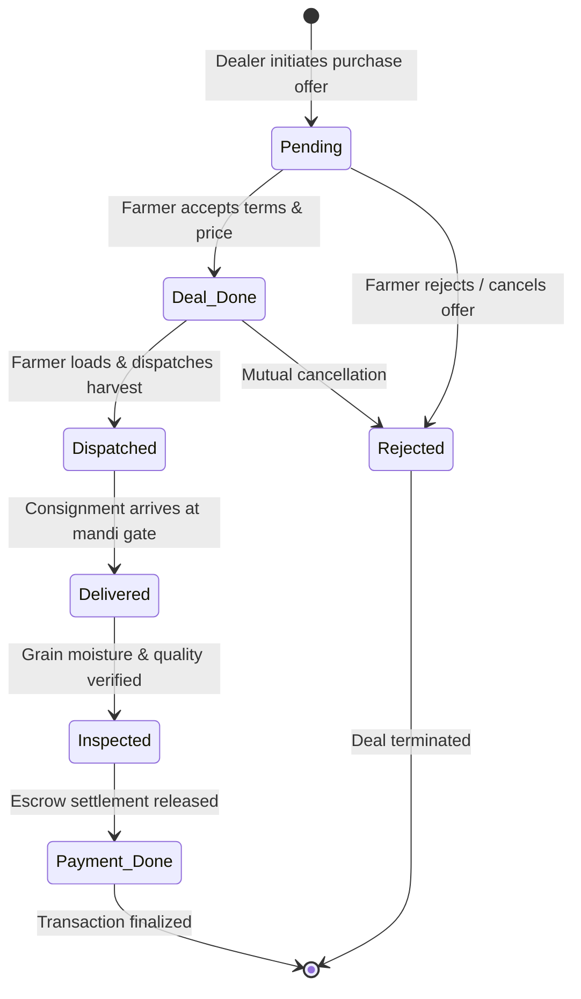

# Kisaan-E-Mandi — Complete Architectural Specification

## System Overview
**Kissan-E-Mandi** is a scalable digital agricultural marketplace connecting farmers directly with private and institutional dealers. It provides transparent pricing via an automated MSP valuation engine and orchestrates deals through a 6-stage lifecycle synchronized in real-time over WebSockets.

---

## Architectural Diagram

```
┌─────────────────────────────────────────────────────────────────────────────────┐
│                           CLIENT LAYER (React Native / Expo)                    │
│                                                                                 │
│   ┌──────────────────────────┐   ┌───────────────────┐   ┌──────────────────┐   │
│   │ Redux Toolkit Store      │   │ Material UI       │   │ WebSocket Hook   │   │
│   │ - transactionSlice       │   │ (React Native     │   │ useTransaction-  │   │
│   │ - mspSlice               │   │  Paper Stepper,   │   │ Socket (ws://)   │   │
│   │ - listingSlice           │   │  Cards & Modals)  │   │                  │   │
│   └─────────────┬────────────┘   └─────────┬─────────┘   └────────┬─────────┘   │
└─────────────────┼──────────────────────────┼──────────────────────┼─────────────┘
                  │ HTTP Requests (REST)     │                      │ WebSockets (WSS)
                  ▼                          ▼                      ▼
┌─────────────────────────────────────────────────────────────────────────────────┐
│                         ASGI SERVER (Daphne 4.2)                                │
│                                                                                 │
│   ┌────────────────────────────────────────┐   ┌─────────────────────────────┐  │
│   │ HTTP Request Router                    │   │ Django Channels Router      │  │
│   │ (get_asgi_application)                 │   │ (URLRouter)                 │  │
│   └───────────────────┬────────────────────┘   └──────────────┬──────────────┘  │
│                       │                                       │                 │
│                       ▼                                       ▼                 │
│   ┌────────────────────────────────────────┐   ┌─────────────────────────────┐  │
│   │ DJANGO REST FRAMEWORK (DRF)            │   │ TransactionLifecycleConsumer│  │
│   │                                        │   │ (AsyncJsonWebsocketConsumer)│  │
│   │ - /fci/login/ (JWT SimpleJWT)          │   │                             │  │
│   │ - /fci/crops/ (Master MSP list)        │   │ Groups:                     │  │
│   │ - /fci/crop_registers/ (Listings)      │   │ - user_transactions_{id}    │  │
│   │ - /fci/transactions/ (6-Stage CRUD)    │   │ - lifecycle_{id}            │  │
│   │ - /fci/transactions/{id}/transition/   │   │ - marketplace_updates       │  │
│   │ - /fci/msp-valuation/evaluate/         │   └──────────────┬──────────────┘  │
│   └───────────────────┬────────────────────┘                  │                 │
│                       │                                       │                 │
│                       ▼                                       │                 │
│   ┌────────────────────────────────────────┐                  │                 │
│   │ MSP VALUATION ENGINE (Core Service)    │                  │                 │
│   │ - Statutory MSP floor evaluation       │                  │                 │
│   │ - Grade multiplier (A: +5%, C: -10%)   │                  │                 │
│   │ - Moisture penalty (-1%/excess %)      │                  │                 │
│   │ - Fair market price band generator     │                  │                 │
│   └───────────────────┬────────────────────┘                  │                 │
│                       │                                       │                 │
│                       ▼                                       │                 │
│   ┌────────────────────────────────────────┐                  │                 │
│   │ ORM & QUERY OPTIMIZATIONS              │                  │                 │
│   │ - select_related() (eliminates N+1)    │                  │                 │
│   │ - select_for_update() (row-locking)    │                  │                 │
│   │ - transaction.atomic() (concurrency)   │                  │                 │
│   └───────────────────┬────────────────────┘                  │                 │
│                       │ Broadcast on transition ──────────────┘                 │
└───────────────────────┼─────────────────────────────────────────────────────────┘
                        ▼
┌─────────────────────────────────────────────────────────────────────────────────┐
│                    POSTGRESQL 16 (Primary Database)                             │
│                                                                                 │
│   - Connection pooling (conn_max_age = 600)                                     │
│   - Tables: Fci_App_user, Fci_App_crop, Fci_App_crop_register,                  │
│             Fci_App_transaction                                                 │
│   - Composite Indexes: (farmer, status), (dealer, status),                      │
│                        (status, created_at), (farmer_city, dealer_type)         │
│   - ACID Compliance with Row-Level Locks                                        │
└─────────────────────────────────────────────────────────────────────────────────┘
```

---

## 6-Stage Transaction Lifecycle State Machine



### Transition Matrix & Access Controls

| From Stage | Allowed Target | Initiated By | Concurrency Control | Broadcast Event |
|---|---|---|---|---|
| `pending` | `deal_done`, `rejected` | Farmer | `select_for_update()` in `atomic()` | `stage_transitioned` |
| `deal_done` | `dispatched`, `rejected` | Farmer | `select_for_update()` in `atomic()` | `stage_transitioned` |
| `dispatched` | `delivered` | Dealer / Transporter | `select_for_update()` in `atomic()` | `stage_transitioned` |
| `delivered` | `inspected` | Mandi Assayer / Dealer | `select_for_update()` in `atomic()` | `stage_transitioned` |
| `inspected` | `payment_done` | Dealer / System Escrow | `select_for_update()` in `atomic()` | `stage_transitioned` |

---

## Automated MSP Valuation Engine Specification

### Mathematical Model
$$\text{Base Value} = \text{MSP}_{\text{statutory}} \times \text{Quantity}$$
$$\text{Grade Factor} = \begin{cases} +5\% & \text{if Grade A (FAQ Premium)} \\ 0\% & \text{if Grade B (Standard FAQ)} \\ -10\% & \text{if Grade C (Sub-standard)} \end{cases}$$
$$\text{Moisture Deduction} = \max(0, \text{Moisture \%} - 14.0\%) \times 1\% \times \text{MSP}$$
$$\text{Recommended Price} = \text{MSP} + \text{Grade Adjustment} - \text{Moisture Deduction} + \text{Logistics Adj}$$
$$\text{Fair Price Band} = [\text{MSP}, \text{MSP} \times 1.20]$$

---

## Database Indexing & Query Optimizations

### 1. Elimination of N+1 Queries
```python
# Unoptimized (causes 3 * N queries for nested fields):
Transaction.objects.all()

# Optimized (single SQL JOIN):
Transaction.objects.select_related(
    'farmer', 'dealer', 'crop_register', 'crop_register__farmer'
).all()
```

### 2. Composite PostgreSQL Indexes
```sql
CREATE INDEX Fci_App_tra_farmer_status_idx ON "Fci_App_transaction" (farmer_id, status);
CREATE INDEX Fci_App_tra_dealer_status_idx ON "Fci_App_transaction" (dealer_id, status);
CREATE INDEX Fci_App_tra_status_created_idx ON "Fci_App_transaction" (status, created_at);
CREATE INDEX Fci_App_cro_city_dealer_idx ON "Fci_App_crop_register" (farmer_city, dealer_type);
```

### 3. Concurrency Protection with Row-Level Locking
```python
with db_transaction.atomic():
    tx = Transaction.objects.select_for_update().get(pk=pk)
    if not tx.can_transition_to(target_status):
        raise ValidationError(...)
    tx.status = target_status
    tx.save()
```
